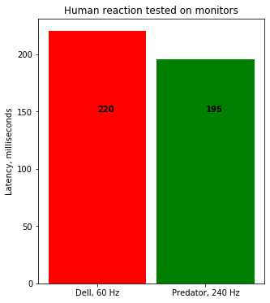
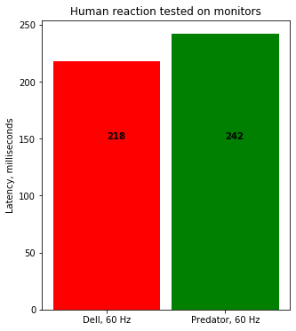

# Comparison of latency of 240 and 60 hz monitors

tldr: 240Hz monitor provides faster response time, which gives you huge advantage in FPS shooters (not even taking into account overall smoothness of the picture/game process).
 

   
 

Though when switched to non-native 60Hz refresh rate Acer demonstrated even higher latency than an old 60Hz Dell.
 

   
 

More in-depth results can be found in the research file. 
